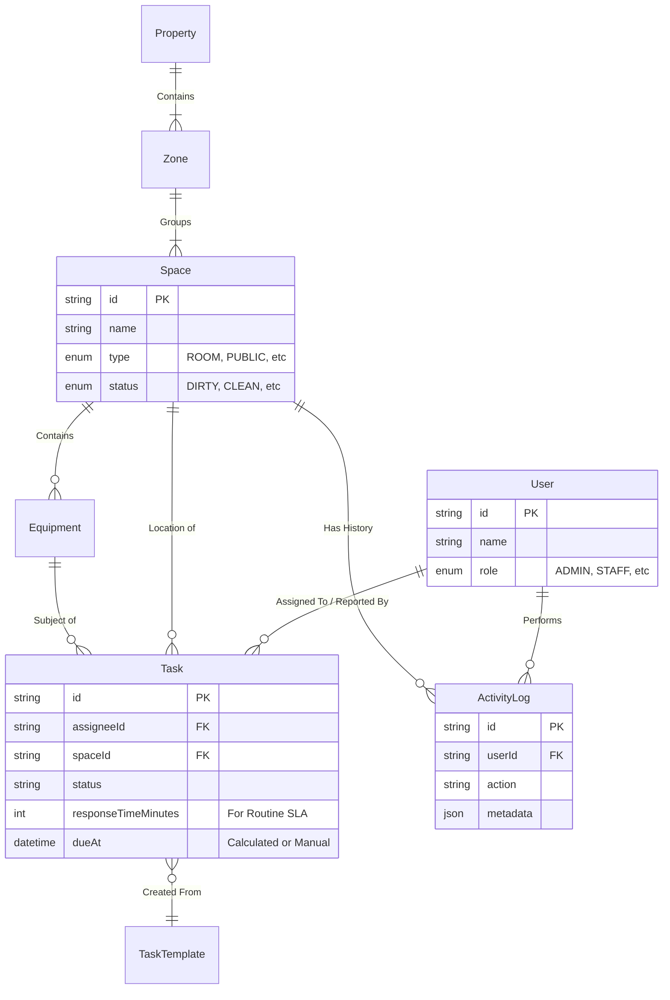

# System Architecture & Data Model

> [!NOTE]
> This document acts as the source of truth for the project's technical architecture and data structure. It should be updated whenever the schema or system design changes.

## 1. System Overview

The **DOMA Housekeeping & Maintenance Tool** is a monorepo-based web application designed to manage hotel operations, including room status, task assignment, and asset inventory.

### Technology Stack
*   **Infrastructure**: Docker (PostgreSQL Database), Localhost (Node.js/Vite Apps).
*   **Backend (`apps/api`)**: 
    *   **Framework**: NestJS (Modular, TypeScript).
    *   **Database**: PostgreSQL 15.
    *   **ORM**: Prisma (Type-safe database access).
    *   **Auth**: Telegram Mini App Auth (Custom validation) + JWT (Planned).
*   **Frontend (`apps/web`)**: 
    *   **Framework**: React (Vite).
    *   **State Management**: React Context (`UserContext`, `LanguageContext`).
    *   **Styling**: Pure CSS / CSS Modules.
    *   **API Client**: Axios (`services/api.ts`).
*   **Shared (`packages/shared`)**:
    *   Common TypeScript interfaces and logical types shared between FE and BE.
    *   Prisma Schema source.

### Architecture Diagram
```mermaid
graph TD
    Client[Web Client (React)]
    API[Backend API (NestJS)]
    DB[(PostgreSQL)]
    Telegram[Telegram API]
    Mews[Mews PMS (External)]

    Client -->|REST / HTTP| API
    API -->|Prisma / SQL| DB
    API -->|Auth Verification| Telegram
    API -.->|Sync (Planned)| Mews
```

---

## 2. Data Model

The database is structured around **Properties**, **Spaces** (Rooms/Areas), and **Tasks** (Operations).

### Core Entities

#### High-Level ER Diagram


### Schema Reference

#### 1. Organizational Hierarchy
*   **Property**: The top-level entity (e.g., "DOMA Portugal").
*   **Zone**: Logical grouping of spaces (e.g., "Floor 1", "Glamping Area").
*   **Space**: A physical location (e.g., "Room 101", "Pool Area").
    *   **Type**: `ROOM`, `PUBLIC`, `OUTDOOR`, `BOH`, `VENUE`, `WELLNESS`, `ATMOS`, `SERVICE`.
    *   **Status**: `DIRTY`, `CLEANING`, `INSPECTED`, `OCCUPIED`, `READY`, `OUT_OF_ORDER`, `OUT_OF_SERVICE`.
    *   **Business Unit**: `HOTEL`, `FNB`, `EVENTS`, `ATMOS`.
    *   **Description**: Freeform text details.
    *   **Blocking**: `blockingReason` (String) and `blockedUntil` (DateTime - triggers `OUT_OF_ORDER`).

#### 2. Operations (Tasks)
*   **Task**: A unit of work.
    *   **Status**: `NEW`, `TRIAGED`, `ASSIGNED`, `IN_PROGRESS`, `BLOCKED`, `DONE`, `VERIFIED`, `CLOSED`, `READY_FOR_INSPECTION`, `REOPENED`.
    *   **Priority**: `P1` (High), `P2` (Medium), `P3` (Low).
    *   **Type**: `HK` (Housekeeping), `MAINTENANCE`, `FRONT_DESK`, `WELLNESS`, `FNB`, `INSPECTION`, `PREVENTIVE`, `OTHER`.
    *   **Locations**: Can be linked to `Space` (ID) or `customLocation` (String).
    *   **Blocking**: `blockLocationUntil` (DateTime) - if set, blocks the linked Space.
    *   **Inspection**: `inspectorId`, `inspectionResult` (PASS/FAIL), `inspectionNotes`.

#### 3. Assets
*   **Equipment**: Physical assets tracked for maintenance.
    *   Linked to a specific `Space`.
    *   Examples: "HVAC Unit", "Pool Pump".

#### 4. Users & Access
*   **User Model**: A User is defined by the intersection of a **Role** (Permission Level) and a **Team** (Department/Domain).
    *   **Roles** (Permissions):
        *   `ADMIN`: Full System Access. Can see all Teams.
        *   `MANAGER`: Team Leader. Restricts view to own Team's tasks. Can Assign/Create.
        *   `STAFF`: Worker. Restricts view to Assigned tasks (or Unassigned in own Team).
        *   `OBSERVER`: Read-only access.
    *   **Teams** (Departments):
        *   `HK` (Housekeeping)
        *   `MAINTENANCE`
        *   `FRONT_DESK`
        *   `FNB` (Food & Bev)
        *   `WELLNESS` (Spa/Gym)
        *   *Note: There is NO "Management" Team. A Manager belongs to one of the above Teams (e.g., "HK Manager").*
    *   **Fields**: `email` (Unique), `telegramId` (Unique), `isOnShift`.

---

## 3. Key Workflows

### Task Creation Flow
1.  **Trigger**: User (Frontend) or Cron Job (Backend).
2.  **Creation**: `POST /tasks` payload validated against `CreateTaskDto`.
    -   **Validation**: Checks if `reporterId` exists.
    -   **Blocking**: If `blockLocationUntil` is present, triggers Space blocking.

### Task Assignment Flow
3.  **Assignment**: Optional auto-assignment logic (future) or manual selection.
4.  **Notification**: Bot sends Telegram message to Assignee (if linked).

### Task Updates & Comments
*   **Activity Logging**: All major actions (Status Change, Assignment, Comment) are stored in `ActivityLog`.
*   **Comments**: Users can discuss tasks via the "Activity" tab or Drawer.
*   **Images**: Tasks support multiple image attachments (Upload/Delete).

### SLA Calculation (Client-Side & Deterministic)
The system calculates `Due Date` and `Overdue Status` dynamically:
1.  **Effective Minutes**:
    -   `URGENT` (P1): Fixed Config (e.g., 60m).
    -   `HIGH` (P2): Fixed Config (e.g., 240m).
    -   `REGULAR` (P3): Uses `task.responseTimeMinutes` (if set) or "No SLA".
2.  **Due Date**: `createdAt` + Effective Minutes.
3.  **Lapse/Overdue**: Displayed visually in Task Lists (Red/Amber/Green).

### Room Status Cycle (Housekeeping)
1.  **Guest Checkout**: Status -> `DIRTY`.
2.  **HK Start**: Cleaner scans/selects room -> Status `CLEANING`.
3.  **HK Finish**: Cleaner marks done -> Status `INSPECTED` (or `READY` if no inspection required).
4.  **Inspection**: Supervisor verifies -> Status `READY`.
5.  **Guest Check-in**: Front Desk/PMS update -> Status `OCCUPIED`.

### Sync (Planned)
*   **Mews PMS**: Logic exists to pull Room Status from Mews.
*   **Mapping**: Mews "Dirty" maps to internal `DIRTY`, "Inspect" to `CLEANING`/`INSPECTED`.

### Location Status Automation
The system automatically updates Space Status based on Task Activity:
1.  **Maintenance Block**:
    -   **Action**: User toggles "Request location block" in Task Form.
    -   **Effect**: 
        -   Space Status -> `OUT_OF_ORDER`.
        -   Space `blockedUntil` -> Set to Task `blockLocationUntil` (default 24h).
        -   Space `blockingReason` -> Updated with Task Description.
2.  **Housekeeping**:
    -   **Action**: Creating an `HK` task.
    -   **Effect**: Space Status -> `DIRTY` (if not already out of order).

## 4. Directory Structure (Monorepo)

```
/
├── apps/
│   ├── api/            # NestJS Backend
│   │   ├── src/
│   │   │   ├── tasks/  # Task Logic
│   │   │   ├── mews/   # PMS Integration
│   │   │   └── bot/    # Telegram Bot
│   └── web/            # React Frontend
│       ├── src/
│       │   ├── pages/  # Route Components
│       │   └── context/# Global UI State
├── packages/
│   └── shared/         # Shared Types & Prisma Schema
├── docker-compose.yml  # DB Orchestration
```
